# hotswapd diagrams

These diagrams describe the implementation on the `main` branch. They show
the user-space daemon, its operating-system boundaries, its single-threaded
event loop, and the main device, storage, registry, and D-Bus interactions.
USB enumeration and hotplug monitoring use `libudev`/eudev; `libusb` is not a
dependency or interaction in this design.

The diagrams describe implemented control flow rather than serving as hardware
validation evidence. The maintainer reports recent testing on a Raspberry Pi
CM5 development kit and plans to repeat it for confirmation. Specific GPIO,
physical USB-cycle, and end-to-end results should be recorded against
[`hotswapd-validation-checklist.md`](hotswapd-validation-checklist.md) before
those individual criteria are marked confirmed.

## System context

`hotswapd` is a privileged user-space service. The Linux kernel and udev expose
hardware state; the daemon owns the cached model and cleanup policy; UI and CLI
clients consume the stable D-Bus API instead of reading transient sysfs state.

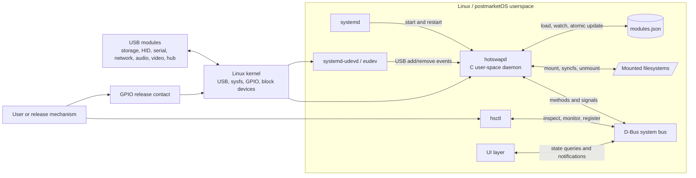

## Internal components

`main.c` owns lifecycle and coordinates all modules through one `epoll` loop.
The `hs_device` linked list is the live source of truth. Identity, power, policy,
and mount data are cached at attach time because most sysfs data can disappear
before a remove event is handled.

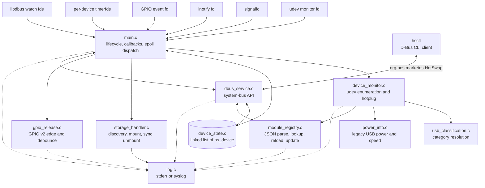

## Single-threaded event dispatch

All runtime event sources converge on `epoll`. D-Bus watches are distinguished
from daemon-owned event contexts, while attach and sync timer contexts carry a
pointer to their associated `hs_device`.

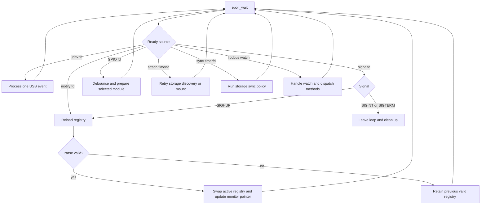

## Attach and classification sequence

Startup enumeration and live `add` events share the same attach callback. An
exact registry category wins; otherwise descriptor classification is used.
Storage receives additional asynchronous handling, but every accepted device
is announced immediately after its initial attach processing.

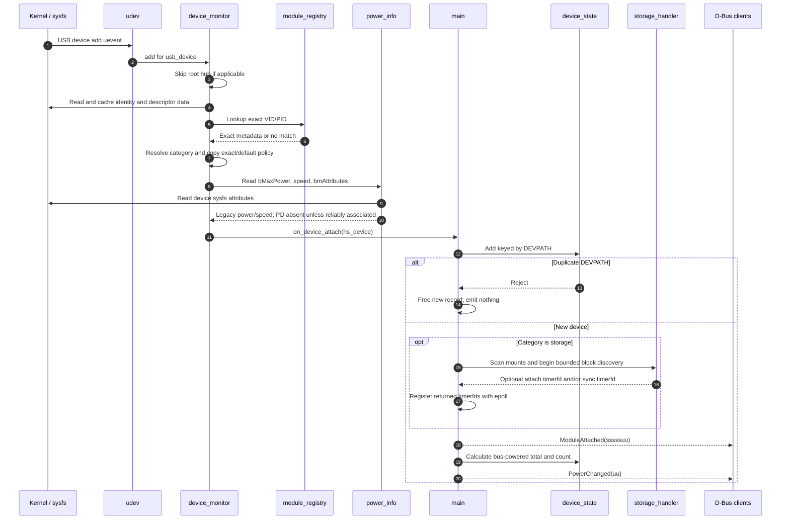

## Category and policy resolution

Classification and policy selection are related but separate. A registry
category overrides USB descriptors. Per-device actions and sync policy override
category defaults; compile-time storage timings are used only when configured
values are absent or invalid.

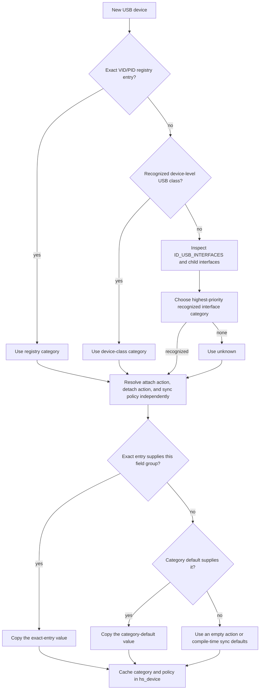

For composite devices, interface-category priority is:
`storage > network > serial > video > audio > HID > hub`. This intentionally
keeps storage cleanup active when a device exposes several functions.

## Storage attach activity

The daemon never mounts a device merely because it is classified as storage.
Mounting requires an explicit exact-entry or category-default `mount` action.
Discovery polls every 200 ms for at most 10 seconds because block nodes and
partitions can appear after the USB-device event.

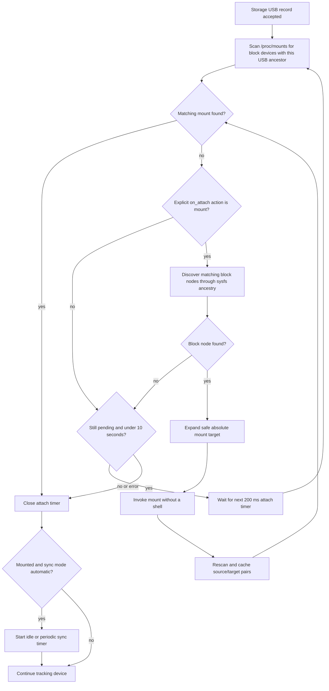

## Safe release and physical detach

The GPIO contact is a preparation request, not the physical detach event. The
daemon emits readiness only after every selected storage mount has been synced
and normally unmounted. A later udev `remove` event completes the state change.

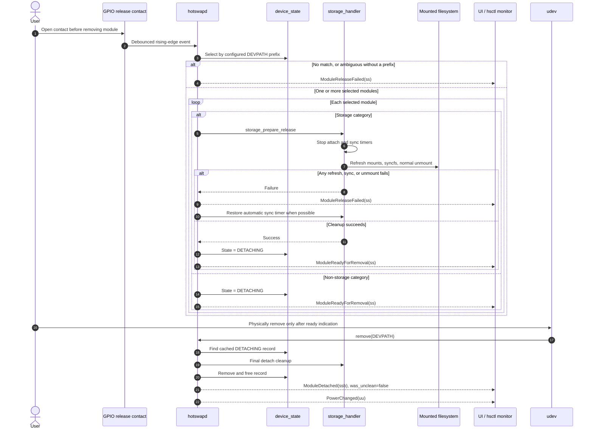

## Surprise-removal cleanup

On an unprepared remove event, sysfs and the physical device may already be
gone. Cleanup therefore uses cached identity and exact mount source/target
pairs. The daemon refuses to unmount a path if it no longer matches the cached
source, and uses lazy unmount only for still-matching stale mounts.

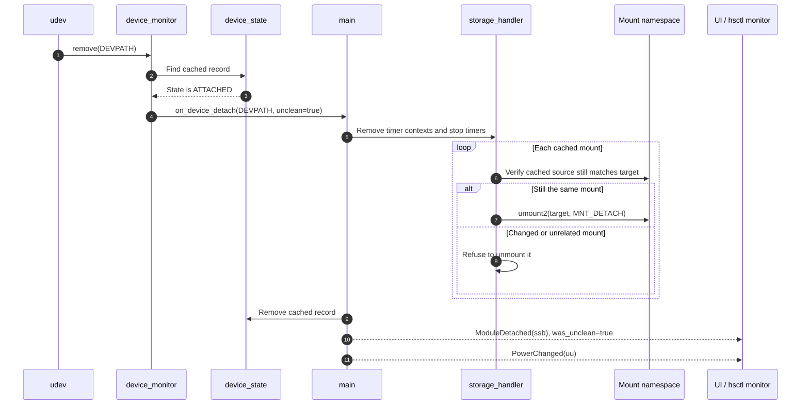

Surprise-removal cleanup cannot recover writes that did not reach the physical
device. It reduces stale mount and daemon-state risk; it does not guarantee no
data loss.

## Device lifecycle state

The state model deliberately has no software-only removal transition: a udev
remove event is authoritative for physical removal. Although `DETACHED` exists
in the enum, the current removal path deletes and frees the record instead of
retaining an observable detached record.

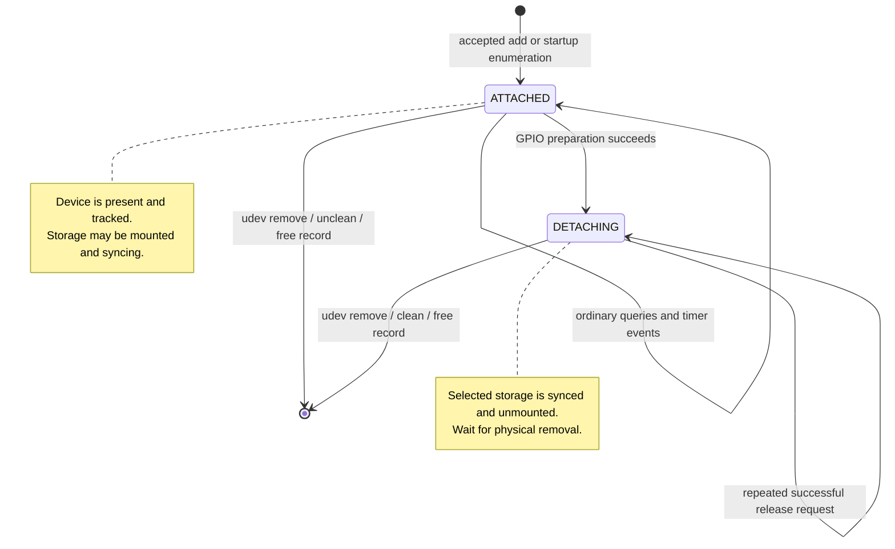

If release preparation fails, the record remains `ATTACHED`; the daemon emits
`ModuleReleaseFailed` and attempts to restore automatic sync handling.

## Registry query, registration, and reload

Read-only registry listing is available to ordinary D-Bus clients. Mutation is
performed inside the root-owned daemon, and `RegisterModule` additionally
checks that the caller UID is root and the requested DEVPATH is currently
tracked.

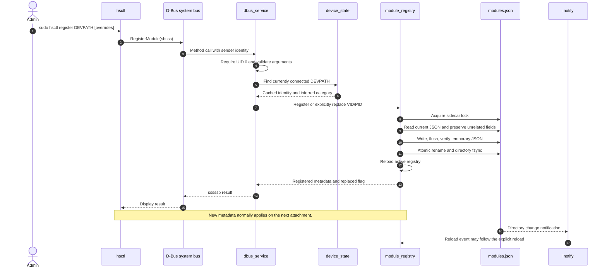

External edits and `SIGHUP` use the same guarded reload behavior:

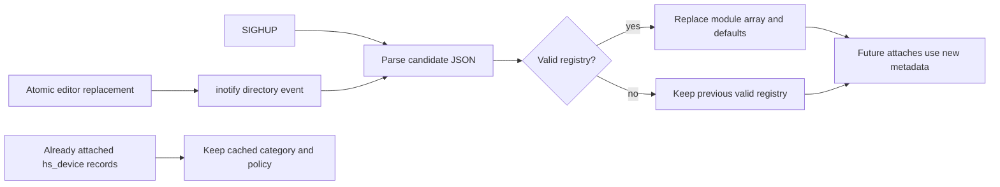

## D-Bus contract

All messages use bus name and interface `org.postmarketos.HotSwap` at object
path `/org/postmarketos/HotSwap`.

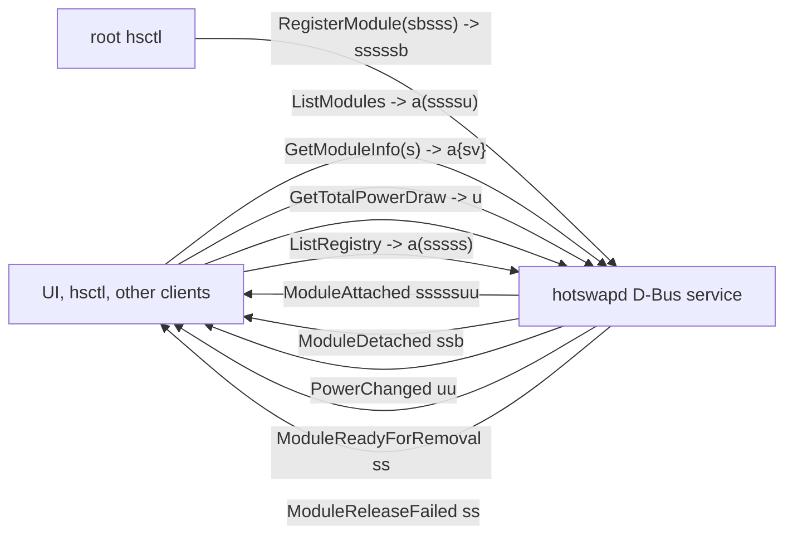

Normal clients may call the four read-only methods and receive signals under
the supplied D-Bus policy. Registration is restricted to root. A reconnecting
UI should call `ListModules`, subscribe to signals, and use `GetModuleInfo` for
details rather than depending on sysfs after removal.
